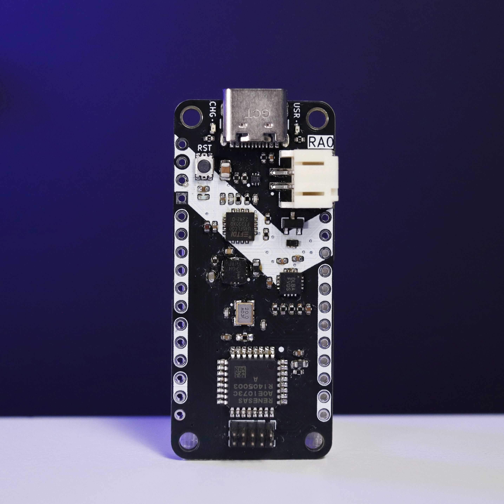
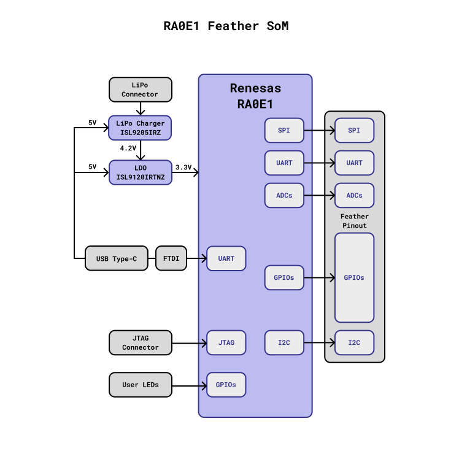

# Zalmotek RA0E1 Feather SoM 

Welcome to the [Zalmotek RA0E1 Feather SoM](https://zalmotek.com/products/RA0E1-Feather-SoM/) GitHub repository!

Here you'll find all the resources you need to get up and running quickly.

## 🪶 What is the RA0E1 Feather SoM?

The [Renesas RA0E1](https://www.renesas.com/en/products/microcontrollers-microprocessors/ra-cortex-m-mcus/ra0e1-32mhz-arm-cortex-m23-entry-level-ultra-low-power-general-purpose-microcontroller) Microcontroller is designed for ultra-low power applications, featuring the Arm® Cortex®-M23 CPU core with a maximum operating frequency of 32 MHz. It's ideal for IoT devices and battery-powered applications requiring extended operation times.

The Feather SoM incorporates the classic Feather features: GPIOs (analog and digital), I2C and SPI communication pins, UART pins, a LiPo battery power plug, and the USB programming port. The SoM also features a USB Type-C for powering the board and for USB debug upload, making it perfect for portable and low-power projects.

## 🐣🏁 Quick Start Guide

### 🔌 Hardware Requirements
- USB-C cable
- [J-Link BASE debugger](https://www.segger.com/products/debug-probes/j-link/models/j-link-base/)

### 💻 Development Environment Setup

---
Thank you for choosing the Zalmotek RA0E1 Feather SoM! We can't wait to see what amazing projects you'll create with it. Happy tinkering! 💻✨
