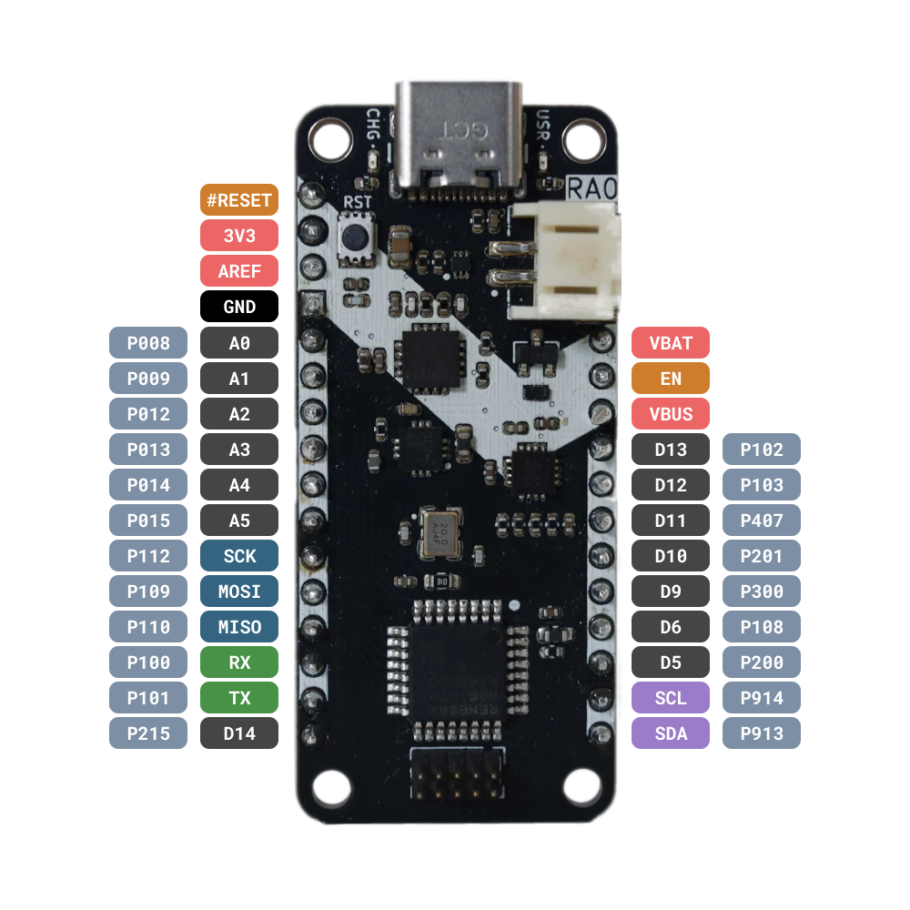

# Zalmotek RA0E1 Feather SoM 

Welcome to the <a href="https://zalmotek.com/products/RA0E1-Feather-SoM/" target="_blank">Zalmotek RA0E1 Feather SoM</a> GitHub repository!

Here you'll find all the resources you need to get up and running quickly.

## 🪶 What is the RA0E1 Feather SoM?

The <a href="https://www.renesas.com/en/products/microcontrollers-microprocessors/ra-cortex-m-mcus/ra0e1-32mhz-arm-cortex-m23-entry-level-ultra-low-power-general-purpose-microcontroller" target="_blank">Renesas RA0E1</a> Microcontroller is designed for ultra-low power applications, featuring the Arm® Cortex®-M23 CPU core with a maximum operating frequency of 32 MHz. It's ideal for IoT devices and battery-powered applications requiring extended operation times.

The Feather SoM incorporates the classic Feather features: GPIOs (analog and digital), I2C and SPI communication pins, UART pins, a LiPo battery power plug, and the USB programming port. The SoM also features a USB Type-C for powering the board and for USB debug upload, making it perfect for portable and low-power projects.

  
  

## 🐣🏁 Quick Start Guide

### 🔌 Hardware Requirements
- USB-C cable
- JTAG Degugger, such as the <a href="https://www.segger.com/products/debug-probes/j-link/" target="_blank">SEGGER J-Link</a>

### 💻 Development Environment Setup

#### Installing Renesas e² studio IDE

The e² studio IDE from Renesas is a comprehensive, user-friendly platform designed to streamline embedded application development. It supports Renesas microcontrollers and combines powerful features with an intuitive interface for coding, debugging, and project management.

First of all, download the latest release of the Flexible Software Package with the e²studio platform installer from the following <a href="https://www.renesas.com/us/en/software-tool/e2studio-information-ra-family" target="_blank">link</a>, according to your OS.

The installer will guide you through the necessary steps. After the installation is finished, launch Renesas e² studio and set up your workspace. This will be the directory where all your projects will be stored.

You will also need to install the J-Link Software pack from <a href="https://www.segger.com/products/debug-probes/j-link/technology/flash-download/" target="_blank">here</a>.

#### Running your first project

Once you have all the tools installed, follow <a href="https://github.com/Zalmotek/zalmotek-RA0E1-feather/tree/main/firmware/Blink" target="_blank">this</a> guide to learn how to import, build, and run a project in the e² studio IDE. 

---
Thank you for choosing the Zalmotek RA0E1 Feather SoM! We can't wait to see what amazing projects you'll create with it! 💻✨
